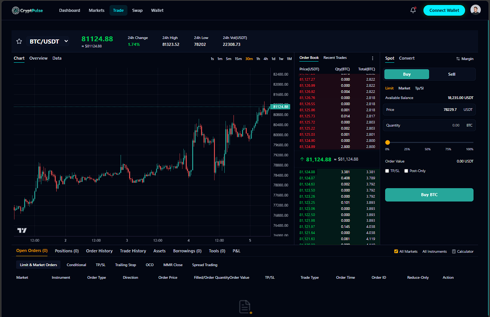

# 📈 CryptPulse | Next-Generation Crypto Trading Platform

> A modern, highly performant, and real-time cryptocurrency dashboard and advanced trading interface built with Next.js (App Router), React 19, and TypeScript.



## ✨ Key Features

- **🔴 Real-Time Market Data:** Integrated **Binance WebSockets** (`!ticker@arr` Combined Stream) to deliver live, low-latency price updates for hundreds of pairs simultaneously without overwhelming browser resources.
- **📈 Professional Trading Charts:** Implemented TradingView-style interactive candlestick charts using **Lightweight Charts**, alongside portfolio analytics using **Recharts** and **Nivo**.
- **⚡ Advanced Data Tables:** Custom-built data tables featuring compound sorting, pagination, and debounced searching. Optimized heavily using `useMemo` and `useCallback` to eliminate cascading renders.
- **🛡️ Robust Forms & Validation:** Secure and optimized trading/wallet forms managed by **React Hook Form** and strongly typed schema validation using **Zod**.
- **💫 Fluid Animations & UI:** Delivered a premium UX with complex, buttery-smooth animations using **Framer Motion** and interactive background effects with **tsParticles**.
- **🏗️ State Management Architecture:** Leveraged **Redux Toolkit (RTK)** for global application state alongside localized React Context (`TradeContext`) for modular trading logic.
- **📱 Pixel-Perfect Responsive Design:** Fully responsive, mobile-first design using the newly released **Tailwind CSS v4**.

## 🛠️ Comprehensive Tech Stack

### Core
- **Framework:** Next.js 16 (App Router)
- **Library:** React 19
- **Language:** TypeScript

### State & Data Handling
- **Global State:** Redux Toolkit (`react-redux`)
- **Local State:** React Context API
- **Data Fetching:** Native `fetch` (REST) & Native `WebSocket` (Binance Streams)
- **Forms & Validation:** React Hook Form + Zod (`@hookform/resolvers`)

### UI, Styling & Animations
- **Styling:** Tailwind CSS v4
- **Animations:** Framer Motion, React Parallax Tilt
- **Effects:** tsParticles
- **Components:** Swiper (Carousels), React Vertical Timeline
- **Icons:** Lucide React, React Icons

### Data Visualization & Charts
- **Trading Charts:** Lightweight Charts (by TradingView)
- **Analytics Charts:** Recharts, `@nivo/pie`
- **Utilities:** `qrcode.react` (for wallet addresses)

## 📂 Project Architecture

The project follows a highly scalable modular structure leveraging Next.js Route Groups for clean separation of concerns:

```text
📦 cryptpulse
├── 📂 app
│   ├── 📂 (auth)               # Authentication flows (Login/Register)
│   ├── 📂 (dashboard)          # Core Trading & Dashboard Application
│   │   ├── 📂 _components      # Layouts & UI specific to the dashboard
│   │   ├── 📂 dashboard        # Main overview and market summary
│   │   ├── 📂 markets          # Real-time crypto market tables
│   │   ├── 📂 swap             # Quick token conversion interface
│   │   ├── 📂 trade            # Advanced Trading UI (Charts, Orderbook)
│   │   │   ├── 📂 components   # Trade specific components
│   │   │   └── 📄 TradeContext.tsx # Localized state management for trades
│   │   ├── 📂 wallet           # User portfolio and balances
│   │   └── 📄 layout.tsx       # Dashboard-specific layout wrapper
│   ├── 📂 (main)               # Public marketing/landing pages
│   └── 📄 layout.tsx           # Global Root Layout
├── 📂 components               # Shared Global Components
│   ├── 📂 layout               # Global Navbar & Footer
│   ├── 📂 section              # Reusable page sections
│   └── 📂 ui                   # Base UI elements
├── 📂 hooks                    # Custom React Hooks
│   └── 📄 useDebounce.tsx      # Optimization hook for search inputs
├── 📂 lib                      # Utilities & Helpers
│   └── 📄 validations.ts       # Zod schemas & form validation logic
└── 📂 public                   # Static assets (Images, Icons)


🚀 Getting Started
First, clone the repository and install the dependencies:

git clone https://github.com/AL-Shewehi/cryptopulse.git
cd cryptpulse
npm install
# or
yarn install

Then, run the development server:

npm run dev
# or
yarn dev

Open http://localhost:3000 with your browser to see the result. No environment variables (.env) are required to run the core functionalities of this project.

👨‍💻 Author
Mahmoud Al-Shewehi

Frontend Developer

🌐 Portfolio: alshewihi.me

💼 LinkedIn: https://www.linkedin.com/in/mahmoud-alshewihi

🐙 GitHub: https://github.com/AL-Shewehi

If you find this project interesting or helpful, please consider leaving a ⭐ on the repository!